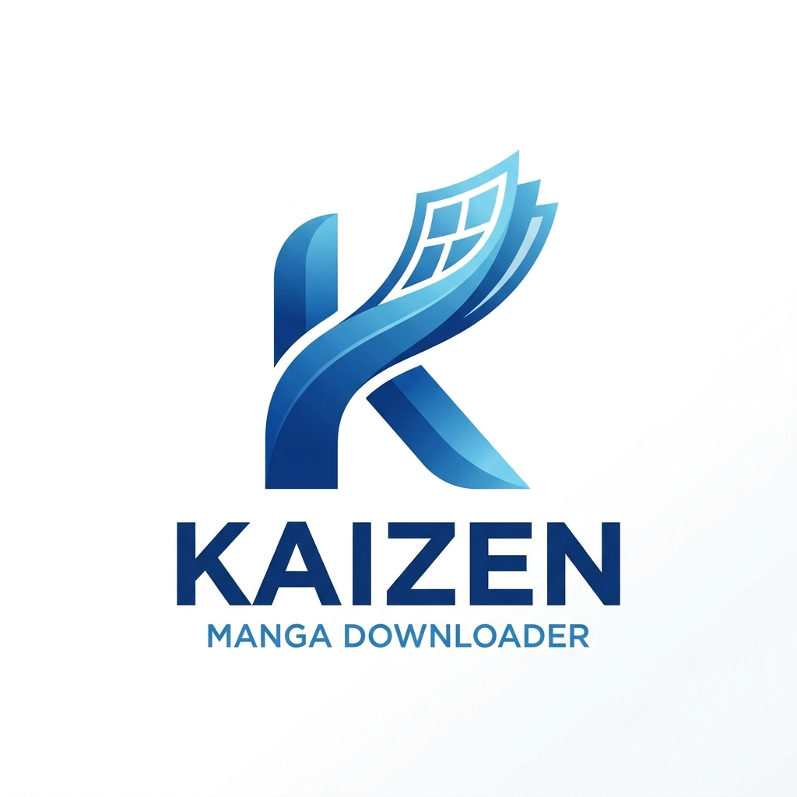
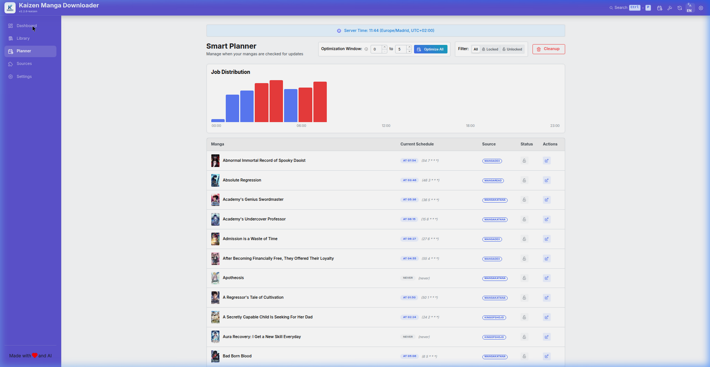
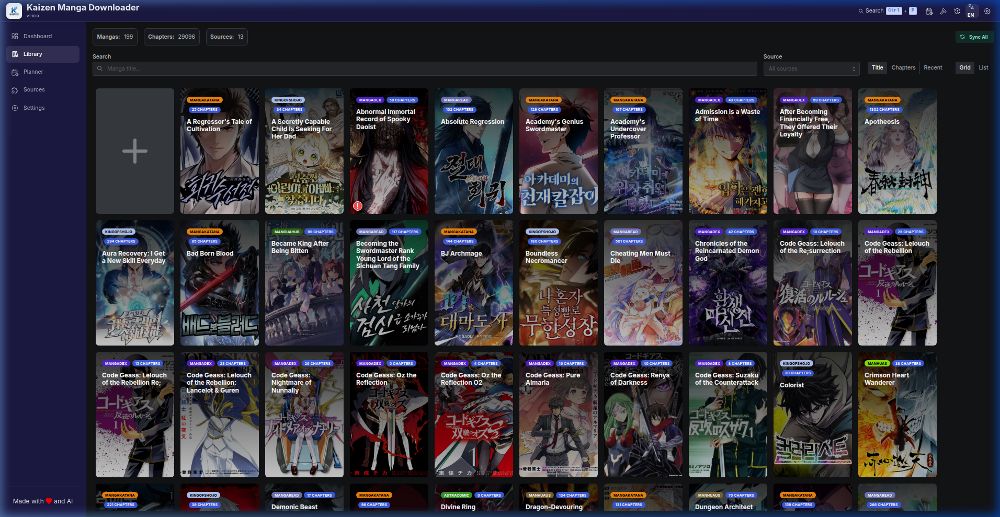
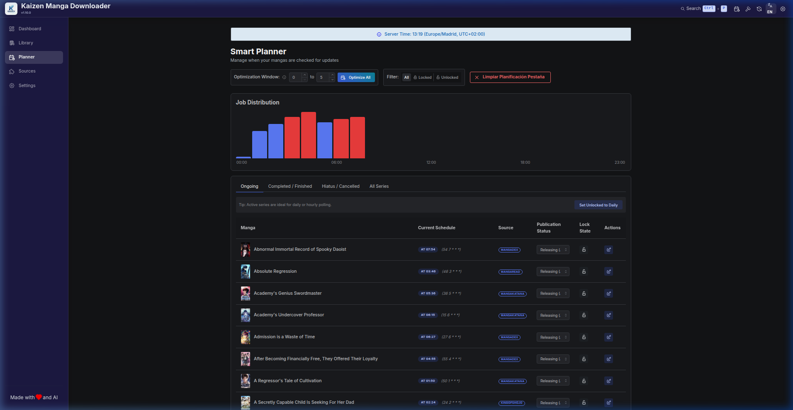

# </img> Kaizen

**Kaizen** is a modern, premium self-hosted manga downloader and manager. This project was born to continue the legacy of the original **Kaizoku**, which was abandoned by its creator. Kaizen introduces a complete visual overhaul, advanced responsiveness, and a smart scheduling system to keep your library always up to date.



## ✨ Features

- **🚀 Premium UI/UX**: A stunning "Glassmorphism" interface based on Mantine UI v5, featuring curated Indigo themes and fully localized elements.
- **📊 Advanced Analytics**: Real-time donut chart visualization of storage distribution by source, along with total library size tracking.
- **🔍 Intelligent Metadata Search**: Automated fallback search logic that leverages alternative titles (synonyms) from AniList and MangaDex to maximize matching success across all providers.
- **⚙️ Configurable Fallback Architecture**: Seamlessly switch or prioritize sequential API providers (**AniList First** vs. **MangaDex First**) dynamically directly from the user Settings menu.
- **✏️ Manual Metadata Control**: Surgical editing capabilities for covers (URLs or local uploads) and custom synopses with automated disk-level persistence.
- **📱 Ultra-Stable Layout Integration**: Verified horizontal and vertical viewport rendering logic to prevent mobile rotation panics.
- **🔗 Universal Reader Interoperability**: Automatic `cover.jpg` extraction for absolute native compatibility with **Kavita**, **Komga**, and other media servers.
- **📁 Extensible REST API**: Premium HTTP REST endpoints supporting advanced filtering (`genre`, `author`, `status`), real-time computed read progress states, and secure transaction-level updates (`PATCH` actions) via Bearer tokens. Features an interactive Swagger API playground and query builder at `/api-docs`.
- **🖥️ Real-time Server Log Viewer**: Integrated terminal under **Settings > Maintenance** allowing users to query, search, and live-filter server logs by level or preset tags, with dynamic runtime log-level switching.
- **📅 Smart Background Scheduler**: Optimized asynchronous concurrency checks preventing database saturation or rate-limiting.

## 📸 Interface Previews

| Dashboard | Library | Planner |
| :---: | :---: | :---: |
|  |  |  |

## 🔌 API Integration

Kaizen exposes a modular REST API that allows other applications to integrate with it. The API is documented interactively using Swagger.

### Getting Started

1. **Enable the API**: Log in to Kaizen, go to **Settings > Access Control**, and toggle **External REST API** to "On".
2. **Generate a Token**: Go to the **Accounts** (Users) page and generate an API Token for your specific user account.
3. **Authenticate**: Provide this Bearer token in the `Authorization` header of your HTTP requests.

```bash
curl -H "Authorization: Bearer YOUR_USER_API_TOKEN" http://localhost:3000/api/v1/mangas
```

### Documentation

You can view the full interactive OpenAPI (Swagger) documentation, test endpoints, and explore the schema by navigating to `/api-docs` on your Kaizen instance (e.g., `http://localhost:3000/api-docs`).

## 🔄 Migration & Compatibility

Kaizen is fully backward compatible with existing Kaizoku deployments. 

- **Environment Variables**: Use `KAIZEN_` as a prefix for all variables. If not found, the app automatically falls back to `KAIZOKU_` prefixes.
  - `KAIZEN_PORT` (falls back to `KAIZOKU_PORT`)
  - `KAIZEN_LOG_PATH` (falls back to `KAIZOKU_LOG_PATH`)
- **Database & Data**: All existing data and configurations from Kaizoku are preserved and fully compatible.
- **Persistent Volumes**: Two Docker Compose layouts are provided:
  - **Fresh Installations**: Use the default `docker-compose.yml` for pure brand consistency (uses `./kaizen/` folders).
  - **Upgrading Legacy Kaizoku**: Use `docker-compose.kaizoku-upgrade.yml` to launch with existing `./kaizoku/` host mappings.

## 🚀 Deployment

### Fresh Installation

Deploy clean Kaizen instances using the standard `docker-compose.yml` file:

```yaml
version: '3'

volumes:
  db:
  redis:

services:
  app:
    container_name: kaizen
    image: d4nj3s/kaizen:latest
    environment:
      - DATABASE_URL=postgresql://kaizen:kaizen@db:5432/kaizen
      - KAIZEN_PORT=3000
      - REDIS_HOST=redis
      - REDIS_PORT=6379
      - PUID=1000
      - PGID=1000
      - TZ=Europe/Madrid
    volumes:
      - <path_to_library>:/data
      - <path_to_config>:/config
      - <path_to_logs>:/logs
    depends_on:
      db:
        condition: service_healthy
    ports:
      - '3000:3000'
  redis:
    image: redis:7-alpine
    volumes:
      - redis:/data
  db:
    image: postgres:alpine
    restart: unless-stopped
    healthcheck:
      test: ['CMD-SHELL', 'pg_isready -U kaizen']
      interval: 5s
      timeout: 5s
      retries: 5
    environment:
      - POSTGRES_USER=kaizen
      - POSTGRES_DB=kaizen
      - POSTGRES_PASSWORD=kaizen
    volumes:
      - db:/var/lib/postgresql/data
```

### Upgrading Legacy Kaizoku

For existing deployments, launch using the dedicated upgrade layout:

```bash
docker compose -f docker-compose.kaizoku-upgrade.yml up -d
```

## 🛠️ Development

### Requirements

- Node.js 18
- pnpm
- Docker
- [mangal](https://github.com/metafates/mangal)

### Getting Started

```bash
git clone https://github.com/kaizen-Architecture/Kaizen-Manga-Downloader.git
cd Kaizen-Manga-Downloader
cp .env.example .env
pnpm i
docker compose up -d redis db
pnpm prisma migrate deploy
pnpm dev
```

Open [http://localhost:3000](http://localhost:3000) to see the dashboard.

## 🙏 Credits

Kaizen is a complete evolution of the original [Kaizoku](https://github.com/oae/kaizoku) by [@oae](https://github.com/oae). Following the archiving of the original project, Kaizen maintains and improves the codebase for the community.

Special thanks to [@metafates](https://github.com/metafates) for the [mangal](https://github.com/metafates/mangal) engine.
